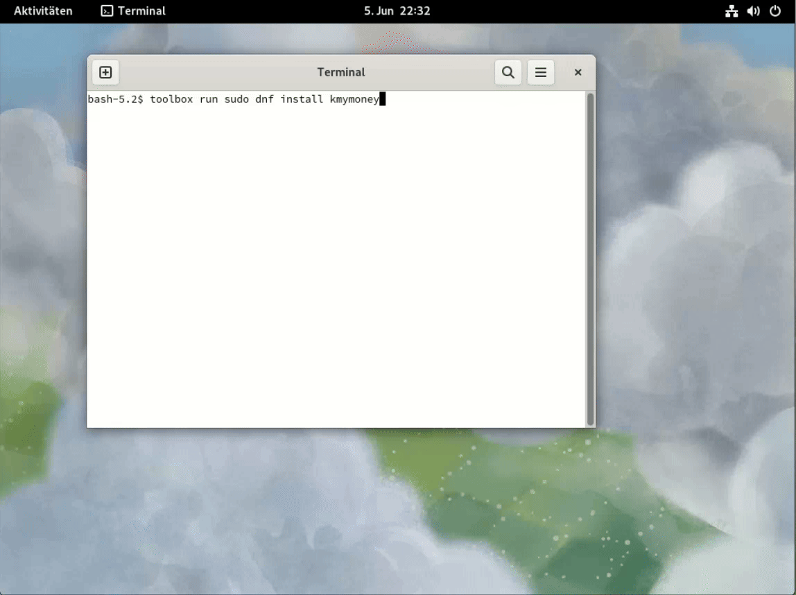

[](README.md)
[](README.de.md)

**Toolbox-export** is a small project that aims to fill a small gap in [Fedora's toolbox](https://docs.fedoraproject.org/en-US/fedora-silverblue/toolbox/).

A [frequently requested toolbox feature](https://github.com/orgs/community/discussions/31132) is the export of application starters. This mini-project aims to provide the missing feature.

Toolbox-export is basically an adaptation of the distrobox shell script distrobox-export to toolbox. It adopts its options and call syntax as much as possible.

## Examples:



### Export of an app:

```
toolbox-export --app texstudio
```

This command copies the original .desktop files with the necessary icons and adds a prefix `toolbox run -c container name to the starter and saves the files in the home directory so that they can be found like other apps e.g. by GNOME.

### Export a binary:

```
toolbox-export --bin /usr/bin/gview --export-path $HOME/.local/bin
```

creates a wrapper that allows to run gview both inside and outside the toolbox container. The `--export-path` option is optional; the wrappers will be installed to `$HOME/.local/bin` if you omit the option.

### Delete exported app starters and binary wrappers:

```
toolbox-export --app texstudio --delete
toolbox-export --bin /usr/bin/gview --export-path $HOME/.local/bin --delete
```

The export can be undone by calling the same command with the additional `--delete` option.

## Differences to distrobox-export

Toolbox is (according to the official documentation) based on rootless podman containers only. Therefore, toolbox-export cannot support options for containers with root privileges. Exported binaries must not be called from root or with sudo, this could render the toolbox container unusable! Therefore, the generated wrappers contain a check to block an accidental call as root (from the host):

```
$ sudo ~/.local/bin/gview /etc/passwd
You must not run gview as root in a toolbox container!
```

Unlike distrobox-export, toolbox-export can be called on the host and not only in the containers, so there is an additional option `--container` (or `-c` for short), for example:

```
# export firefox from "mytoolbox"
toolbox-export --container mytoolbox --app /usr/share/application/firefox.desktop 
# export ripgrep from "mytoolbox
toolbox-export -c mytoolbox --bin /usr/bin/rg
# remove ripgrep import
toolbox-export --container mytoolbox --bin /usr/bin/rg --delete
Installation
```

## Installation

**Toolbox-export** has been developed and tested on and for Fedora Silverblue 38-40. On other Linux distributions that support toolbox (or podman-toolbox), adaptations are probably still required.

### Dependencies

- coreutils
- toolbox
- make
- asciidoctor
- sqlite3

### Installation by dnf in Fedora:

```
sudo dnf copr enable joka63/toolbox-export
sudo dnf install toolbox-export
```
This is possible on the Fedora host and within a Fedora based toolbox container as well.

### Installation by git clone:

```
git clone https://github.com/joka63/toolbox-export
cd toolbox-export
make
PREFIX=~/.local make install 	
```

### Manual Installation

Just copy the shell script [toolbox-export](toolbox-export) into any directory in PATH, I recommend `$HOME/.local/bin`.

## Manpage

[toolbox-export(1)](doc/toolbox-export.1.asciidoc)

## License

**Toolbox-export** is free software, available under the [GNU General Public License, Version 3 or later][GPL-3.0-or-later].

  [GPL-3.0-or-later]: https://www.gnu.org/licenses/gpl.html
